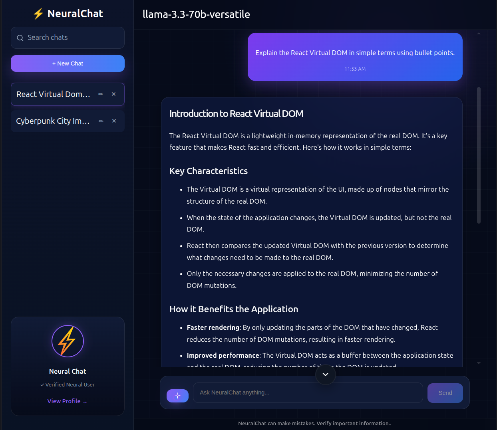
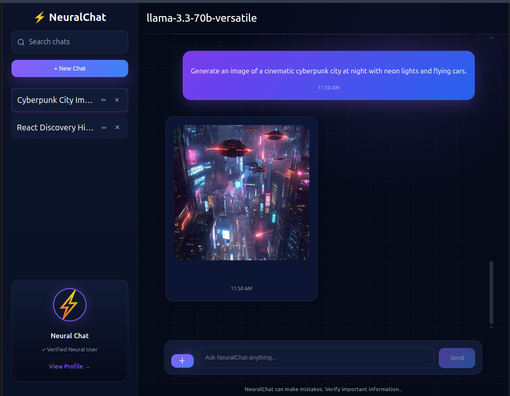
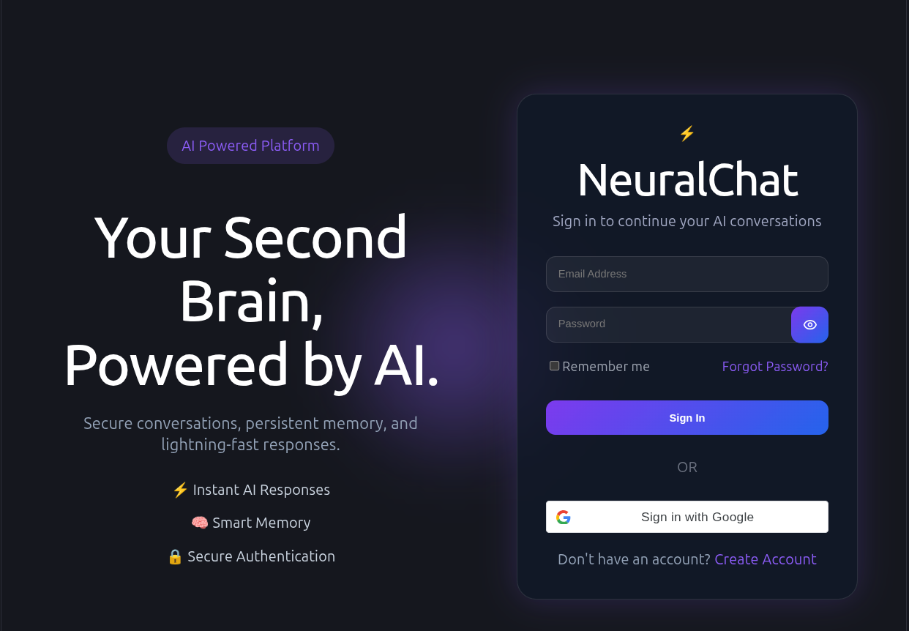
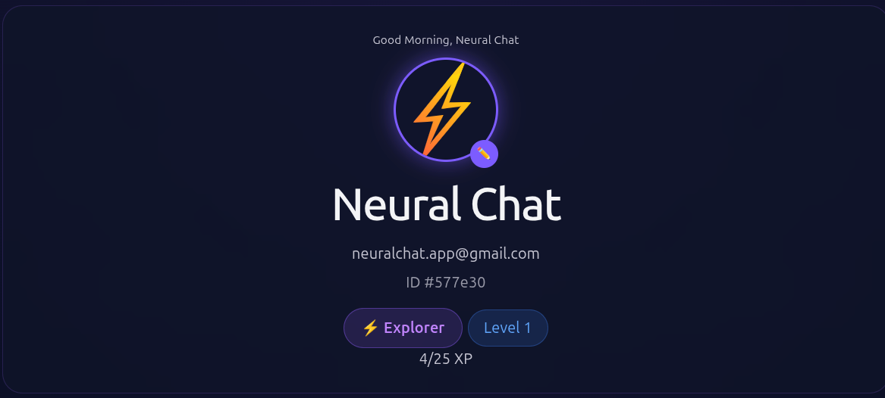
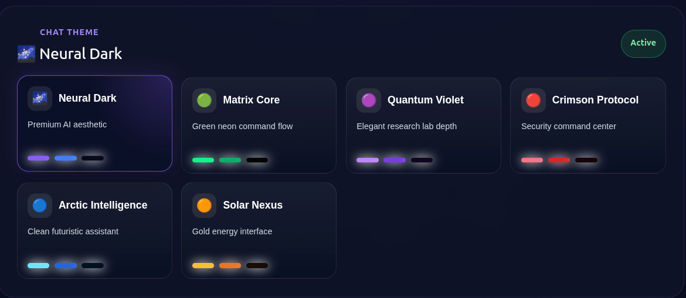
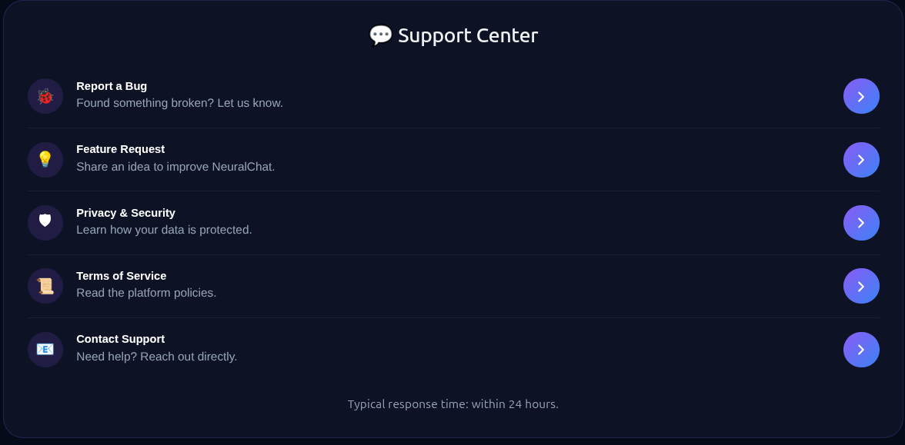
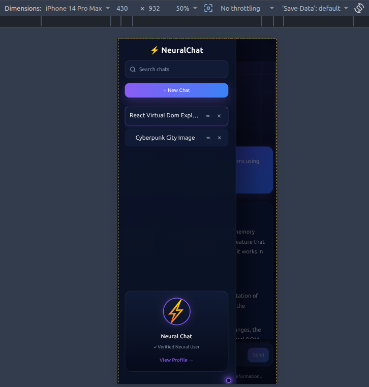

<div align="center">

# ⚡ NeuralChat

### Your Second Brain, Powered by AI.

A modern full-stack AI platform that combines intelligent conversations, AI-powered image generation, secure authentication, beautiful customization, and a thoughtfully crafted user experience into one seamless application.

<br>

<p align="center">

<a href="YOUR_LIVE_DEMO_URL">
    
</a>

<a href="YOUR_GITHUB_REPO">
    
</a>

</p>

<p align="center">


</p>

<p align="center">


</p>

</div>

---

<p align="center">

NeuralChat is a full-stack AI application built to explore what a modern conversational platform should feel like—not only in terms of intelligence, but also in design, usability, responsiveness, and performance.

Rather than recreating an existing AI chatbot, the goal was to build an experience that feels polished from end to end. Every interface, interaction, animation, and workflow has been thoughtfully designed to provide a fast, intuitive, and enjoyable user experience while following scalable full-stack development practices.

Powered by Groq AI, Cloudinary, MongoDB Atlas, Google OAuth, and modern web technologies, NeuralChat demonstrates how multiple services can be integrated into a cohesive production-ready application.

</p>

---

<p align="center">

NeuralChat is a full-stack AI application built to explore what a modern conversational platform should feel like—not only in terms of intelligence, but also in design, usability, responsiveness, and performance.

Instead of recreating an existing AI chatbot, the goal was to build an experience that feels polished from end to end. Every interface, interaction, animation, and workflow has been designed to provide a smooth and enjoyable user experience while following scalable full-stack development practices.

From real-time AI conversations and image generation to secure authentication, customizable themes, responsive layouts, and integrated support tools, NeuralChat demonstrates how modern web technologies can be combined into a production-ready application.

</p>

---

# 📑 Table of Contents

- [🚀 Quick Preview](#-quick-preview)
- [✨ Features](#-features)
- [🖼️ Application Showcase](#️-application-showcase)
- [🛠️ Technology Stack](#️-technology-stack)
- [📂 Project Structure](#-project-structure)
- [🚀 Getting Started](#-getting-started)
- [🔐 Environment Variables](#-environment-variables)
- [📌 Roadmap](#-roadmap)
- [🤝 Contributing](#-contributing)
- [👨‍💻 Author](#-author)

---

# 🚀 Quick Preview

### 💬 AI Conversation Experience

<p align="center">
  
</p>

---

### 🎨 AI Image Generation

<p align="center">
  
</p>

---

# ✨ Features

NeuralChat combines modern AI capabilities with a premium user experience to create an application that feels both powerful and intuitive.

| Feature                      | Description                                                                                                                                               |
| ---------------------------- | --------------------------------------------------------------------------------------------------------------------------------------------------------- |
| 💬 AI Conversations          | Chat with powerful large language models through a fast, responsive, and beautifully designed interface.                                                  |
| 🎨 AI Image Generation       | Generate AI-powered images directly inside conversations without leaving the application.                                                                 |
| 📝 Conversation History      | Automatically save, organize, search, rename, and revisit previous conversations.                                                                         |
| 🔐 Secure Authentication     | Email/password authentication with JWT sessions and Google OAuth integration.                                                                             |
| ☁️ Cloud Image Storage       | Upload and store generated images securely using Cloudinary.                                                                                              |
| 🎭 Multiple Chat Themes      | Instantly switch between six handcrafted interface themes with unique color palettes.                                                                     |
| 👤 Profile Dashboard         | Personalize your account, manage themes, and view profile information through a dedicated dashboard.                                                      |
| 🛟 Integrated Support Center | Built-in pages for reporting bugs, requesting features, privacy information, terms, and contact support.                                                  |
| 📱 Fully Responsive Design   | Optimized layouts for desktop, tablet, and mobile devices with adaptive navigation.                                                                       |
| ⚡ Premium User Experience   | Glassmorphism, smooth animations, custom dialogs, floating navigation, polished interactions, and thoughtful micro-animations throughout the application. |

---

# 🖼️ Application Showcase

## 🔐 Authentication Experience

<p align="center">
  
</p>

---

## 👤 Profile Dashboard

<p align="center">
  
</p>

---

## 🎭 Theme Gallery

<p align="center">
  
</p>

---

## 🛟 Integrated Support Center

<p align="center">
  
</p>

---

## 📱 Mobile Responsive Design

<p align="center">
  
</p>

---

# 🛠️ Technology Stack

NeuralChat is built using a modern JavaScript stack focused on scalability, performance, maintainability, and developer experience.

| Category              | Technologies                                |
| --------------------- | ------------------------------------------- |
| **Frontend**          | React, Vite, React Router, Axios            |
| **Backend**           | Node.js, Express.js                         |
| **Database**          | MongoDB Atlas, Mongoose                     |
| **Authentication**    | JWT Authentication, Google OAuth 2.0        |
| **AI Services**       | Groq API, Pollinations AI                   |
| **Cloud Storage**     | Cloudinary                                  |
| **Email Services**    | Nodemailer, Gmail SMTP                      |
| **Styling**           | CSS3, Responsive Design, Glassmorphism      |
| **Development Tools** | Git, GitHub, ESLint                         |
| **Deployment Ready**  | Environment Variables, Modular Architecture |

---

# 📂 Project Structure

The project follows a modular client-server architecture, making it easy to maintain, extend, and scale.

```text
NeuralChat/
│
├── README/
│   └── images/
│
├── client/
│   ├── public/
│   ├── src/
│   │   ├── assets/
│   │   │   └── brand/
│   │   │
│   │   ├── components/
│   │   │   ├── image/
│   │   │   ├── navigation/
│   │   │   ├── support/
│   │   │   └── ui/
│   │   │
│   │   ├── pages/
│   │   │   └── support/
│   │   │
│   │   ├── routes/
│   │   ├── services/
│   │   ├── theme/
│   │   ├── App.jsx
│   │   ├── main.jsx
│   │   └── index.css
│   │
│   ├── package.json
│   └── vite.config.js
│
├── server/
│   ├── config/
│   ├── controllers/
│   ├── middleware/
│   ├── models/
│   ├── routes/
│   ├── services/
│   ├── utils/
│   ├── .env.example
│   ├── package.json
│   └── server.js
│
├── .gitignore
└── README.md
```

### Folder Overview

| Folder           | Purpose                                                      |
| ---------------- | ------------------------------------------------------------ |
| `client/`        | React frontend built with Vite                               |
| `server/`        | Express backend, authentication, APIs and business logic     |
| `components/`    | Reusable UI components used throughout the application       |
| `pages/`         | Route-level pages including Chat, Profile, Login and Support |
| `services/`      | Frontend API communication layer                             |
| `theme/`         | Theme engine and styling configuration                       |
| `controllers/`   | Request handling and application logic                       |
| `models/`        | MongoDB schemas using Mongoose                               |
| `middleware/`    | Authentication, uploads and request middleware               |
| `utils/`         | Shared helper utilities                                      |
| `config/`        | Database and application configuration                       |
| `README/images/` | Documentation screenshots used throughout this README        |

---

# 🚀 Getting Started

Follow these steps to run NeuralChat locally.

## 1. Clone the repository

```bash
git clone https://github.com/<your-username>/NeuralChat.git

cd NeuralChat
```

---

## 2. Install dependencies

Frontend

```bash
cd client
npm install
```

Backend

```bash
cd ../server
npm install
```

---

## 3. Configure environment variables

Create a local environment file from the provided template.

```bash
cp .env.example .env
```

Update the file with your own credentials before running the application.

Required services include:

- MongoDB Atlas
- Groq API
- Google OAuth
- Cloudinary
- Gmail SMTP
- JWT Secret

---

## 4. Start the backend

```bash
cd server

npm run dev
```

---

## 5. Start the frontend

```bash
cd client

npm run dev
```

Open your browser and navigate to

```text
http://localhost:5173
```

---

# 🔐 Environment Variables

Sensitive credentials are intentionally excluded from the repository.

NeuralChat includes a complete `.env.example` file that documents every required environment variable.

Before running the project, create your own `.env` file and provide valid credentials for the supported services.

This approach keeps API keys and secrets secure while making local setup straightforward.

---

# 📌 Roadmap

The following ideas are planned as future improvements for NeuralChat.

- [x] AI Conversations
- [x] AI Image Generation
- [x] Secure Authentication
- [x] Google OAuth
- [x] Conversation History
- [x] Multiple Themes
- [x] Profile Dashboard
- [x] Responsive Design
- [x] Support Center

### Future Ideas

- [ ] Streaming AI responses
- [ ] Voice conversations
- [ ] AI memory improvements
- [ ] Chat export
- [ ] Progressive Web App (PWA)
- [ ] Desktop application
- [ ] Team workspaces

---

# 🤝 Contributing

Contributions are always welcome.

If you'd like to improve NeuralChat, fix a bug, enhance the interface, or introduce a new feature, feel free to fork the repository and open a pull request.

If you discover a bug or have an idea that could improve the project, please open an issue describing it in as much detail as possible.

Constructive feedback is always appreciated.

---

# 👨‍💻 Author

Developed and maintained by **ArpDarkDesign**.

NeuralChat was created as a personal full-stack project to explore modern AI application development, user experience design, and scalable software architecture.

If you enjoyed exploring the project, consider leaving a ⭐ on the repository. It helps others discover the project and supports its continued development.

---

<div align="center">

### Thank you for checking out NeuralChat ❤️

Built with curiosity, countless cups of coffee ☕, and a passion for creating beautiful software.

</div>
